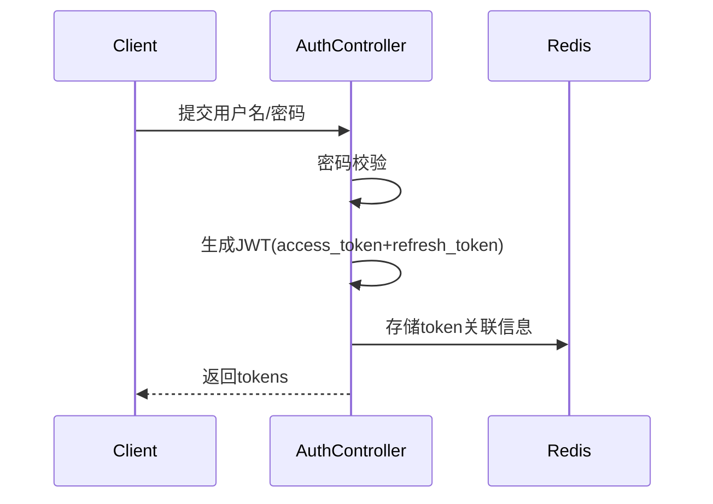

# HZ Server 项目概述

## 1. 项目基本信息

| 项目属性 | 值 |
|---------|---|
| 项目名称 | hz_server |
| 版本 | 1.0.0 |
| 框架 | Quarkus 3.29.3 |
| Java版本 | 21 |
| 数据库 | PostgreSQL 17 |
| 缓存 | Redis 8 |
| 构建工具 | Maven |
| 代码规范 | Alibaba Java Coding Guidelines v1.7.0 |
| 代码覆盖率 | ≥85% (JaCoCo) |
| 安全标准 | OWASP Top 10防护 |

## 2. 技术栈

### 2.1 核心框架
- **Quarkus** - 超音速亚原子Java框架，支持原生编译
- **Hibernate ORM Panache** - 简化的ORM框架
- **SmallRye JWT** - JWT认证和授权
- **WebSocket Next** - WebSocket支持

### 2.2 主要依赖
- **核心框架**
  - `quarkus-rest` - RESTful API支持
  - `quarkus-rest-jackson` - JSON序列化
  - `quarkus-arc` - CDI依赖注入
  
- **数据持久化**
  - `quarkus-hibernate-orm-panache` - 数据库ORM
  - `quarkus-jdbc-postgresql` - PostgreSQL驱动
  - `quarkus-redis-client` - Redis客户端
  
- **安全认证**
  - `quarkus-smallrye-jwt` - JWT认证
  - `quarkus-elytron-security` - 安全框架
  
- **其他工具**
  - `lombok` - 代码简化
  - `mapstruct` - 对象映射
  - `quarkus-qute` - 模板引擎

## 3. 项目架构

### 3.1 包结构
```text
org.huazhi
├── config/                    # 全局配置
│   └── FileConfig.java        # 文件存储配置
├── drones/                    # 无人机业务模块（核心业务）
│   ├── command/              # 指令管理（含指令下发/状态监控）
│   ├── common/               # 公共组件（DTO/常量等）
│   ├── config/               # 无人机配置管理
│   ├── device/               # 设备管理（设备注册/状态上报）
│   ├── media/                # 媒体管理（图片/视频流处理）
│   ├── model/                # 型号管理（无人机型号库）
│   ├── routelibrary/         # 航线库（航线规划/存储）
│   ├── services/             # 服务管理（微服务注册发现）
│   ├── statistics/           # 统计分析（飞行数据统计）
│   ├── task/                 # 任务管理（任务创建/调度）
│   ├── util/                 # 工具类（加解密/ID生成等）
│   ├── websocket/            # WebSocket通信（实时数据传输）
│   └── workflow/             # 工作流（任务流程引擎）
├── exception/                 # 异常处理
│   ├── BusinessException.java # 业务异常
│   └── GlobalExceptionHandler.java # 全局异常处理器
├── oauth/                     # 认证授权
│   ├── controller/           # 认证端点
│   ├── entity/               # 认证实体
│   └── service/              # 认证服务实现
├── system/                    # 系统管理模块
│   ├── sysauth/              # 权限管理（RBAC实现）
│   ├── sysdict/              # 字典管理
│   └── ...                   # 其他系统模块
└── util/                      # 通用工具类
```

### 3.2 模块分层架构
```text
module/
├── controller/    # 控制器层
│   └── *Controller.java   # 处理HTTP请求，参数校验
├── entity/        # 实体层
│   ├── dto/      # 数据传输对象（API请求/响应）
│   ├── vo/       # 视图对象（前端展示模型）
│   └── enums/    # 枚举定义
├── repository/    # 仓库层
│   └── *Repository.java # 数据库操作接口
└── service/       # 服务层
    ├── *Service.java      # 服务接口定义
    └── impl/     # 服务实现
        └── *ServiceImpl.java # 业务逻辑实现
```

### 3.3 核心流程
1. **HTTP请求处理流程**：
   ```
   客户端 → 拦截器(JWT验证) → 控制器 → 服务层 → 仓库层 → 数据库
                             ↑         ↓
                             异常处理 ← 缓存
   ```

2. **WebSocket通信流程**：
   ```
   无人机设备 → WebSocket端点 → 消息解析 → 指令处理 → 响应推送
   ```

## 4. 核心业务模块

### 4.1 无人机设备管理 (drones/device)
- **核心实体**：
  ```java
  @Entity
  public class DronesDevice extends PanacheEntity {
      public String deviceId;     // 设备唯一标识
      public DeviceType type;     // 设备类型
      public DeviceStatus status; // 在线/离线/故障
      public String ipAddress;    // 最后连接IP
      public LocalDateTime lastHeartbeat; // 最后心跳时间
      @OneToMany
      public List<DeviceParam> params; // 设备参数
  }
  ```

- **关键API**：
  - `POST /api/device/register` - 设备注册
  - `GET /api/device/{id}/status` - 获取设备状态
  - `POST /api/device/heartbeat` - 心跳上报

### 4.2 任务管理 (drones/task)
- **状态机**：
  ```
  新建 → 待执行 → 执行中 → 已完成
          ↓         ↓
          取消        失败
  ```

- **任务调度**：
  ```java
  @Scheduled(every = "30s") 
  void checkPendingTasks() {
      // 查询待执行任务
      // 分配至可用设备
  }
  ```

## 5. API设计规范

### 5.1 通用规则
- 版本控制：`/api/v1/...`
- 响应格式：
  ```json
  {
    "code": 0,
    "msg": "操作成功",
    "data": {},
    "timestamp": 1717745234
  }
  ```

### 5.2 错误代码
| 代码 | 含义 |
|-----|------|
| 0   | 成功 |
| 1001| 参数错误 |
| 2001| 认证失败 |
| 3001| 设备离线 |
| 9999| 系统异常 |

## 6. 安全设计

### 6.1 认证流程


### 6.2 权限控制
```java
@RolesAllowed("ADMIN")
@POST
@Path("/admin/device")
public Response createDevice(DeviceDTO dto) {
    // 仅管理员可访问
}
```

## 7. 部署架构

### 7.1 Docker Compose配置
```yaml
version: '3.8'
services:
  postgres:
    image: postgres:17
    ports:
      - "5433:5432"
    environment:
      POSTGRES_PASSWORD: ${DB_PASSWORD}
  
  redis:
    image: redis:8-alpine
    ports:
      - "6378:6379"
  
  app:
    image: quarkus-app
    build:
      context: .
      dockerfile: src/main/docker/Dockerfile.jvm
    ports:
      - "8080:8080"
    depends_on:
      - postgres
      - redis
```

### 7.2 环境变量配置
```properties
# application.properties
quarkus.datasource.jdbc.url=jdbc:postgresql://postgres:5432/hzdb
quarkus.datasource.username=${DB_USER}
quarkus.datasource.password=${DB_PASSWORD}

quarkus.redis.hosts=redis://redis:6379
```

## 8. 测试策略

### 8.1 测试金字塔
```text
        UI测试 (5%)
     ↗          ↖
API测试 (15%)  集成测试 (20%)
     ↖          ↗
    单元测试 (60%)
```

### 8.2 测试工具
- **单元测试**：JUnit 5 + Mockito
- **集成测试**：TestContainers
- **API测试**：REST Assured
- **性能测试**：JMeter

## 9. 开发规范

### 9.1 分支策略
- `main` - 生产环境分支（保护分支）
- `release/*` - 发布分支
- `feature/*` - 功能开发分支
- `hotfix/*` - 紧急修复分支

### 9.2 提交规范
```
<type>(<scope>): <subject>
// 示例
feat(device): 新增设备状态查询接口
fix(task): 修复任务状态更新竞态条件
```

## 10. 客户端支持

### 10.1 C客户端编译
```bash
# 设备客户端
cd src/main/client/device_client/src
gcc -o device_client main.c auth/ClientAuth.c report/Report.c -lssl -lcrypto
```

### 10.2 WebSocket测试工具
```javascript
// 示例测试脚本
const ws = new WebSocket('wss://localhost:8443/ws');
ws.onmessage = (event) => {
  console.log('Received:', event.data);
};
ws.send(JSON.stringify({command: 'STATUS_UPDATE'}));
```

## 11. 代码生成器

### 11.1 使用流程
```bash
# 生成设备管理模块代码
python src/main/gencode/main.py \
  --module=device \
  --table=drones_device \
  --author=zhangzexin
```

### 11.2 生成内容
- Controller层
- Service层及实现
- Entity实体类
- DTO数据传输对象
- MapStruct映射器
- 前端API定义（TypeScript）

## 12. 监控与运维

### 12.1 健康检查端点
- `/q/health` - 应用健康状态
- `/q/metrics` - Prometheus指标
- `/q/swagger-ui` - API文档

### 12.2 日志配置
```properties
quarkus.log.level=INFO
quarkus.log.file.enable=true
quarkus.log.file.path=/var/log/hz-server.log
```

## 13. 未来规划

### 13.1 短期目标
- [ ] 增加设备固件OTA升级功能
- [ ] 实现分布式任务调度
- [ ] 完善OpenAPI 3.0文档

### 13.2 长期目标
- [ ] 接入AI飞行路径规划
- [ ] 支持边缘计算部署
- [ ] 多语言国际化支持

---
**最后更新**：2025-12-08  
**维护团队**：后端研发组
